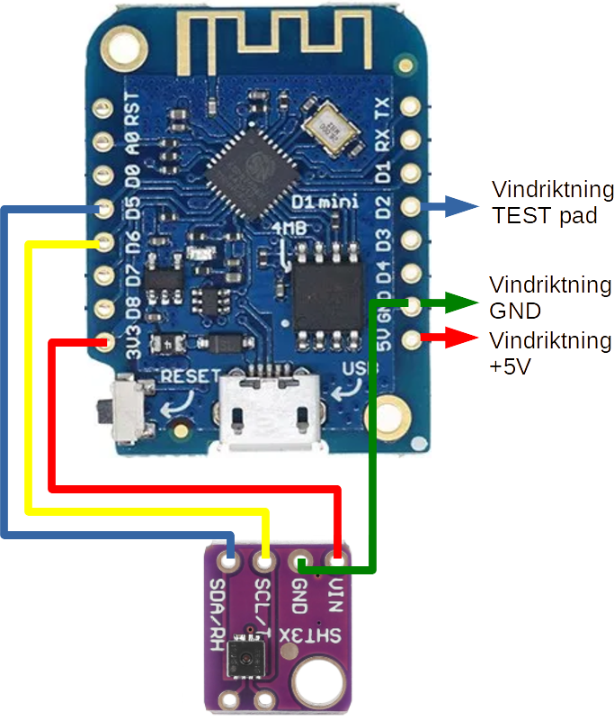
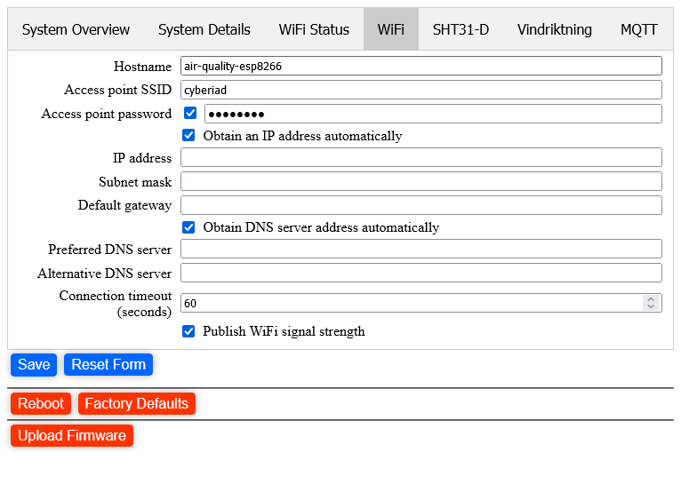
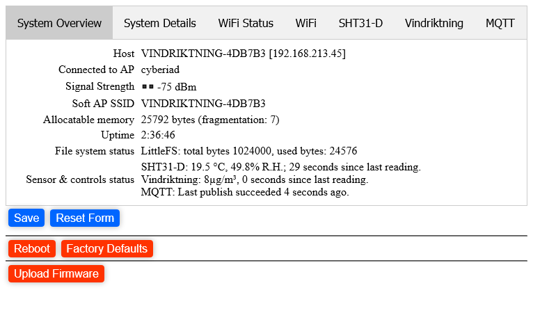
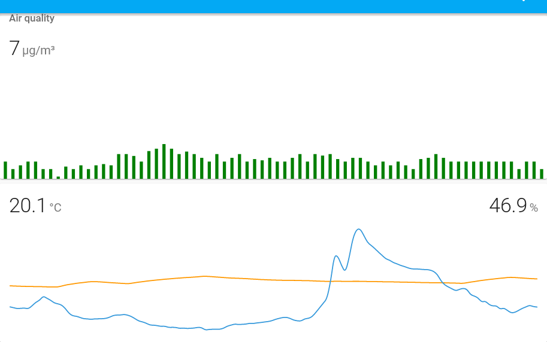

# esp8266_vindriktning
<h1>ESP8266 D1 Mini Ikea Vindriktning Air Quality Sensor with SHT31-D Temperature/Humidity Sensor </h1>

This repository contains an ESP8266 sketch for an Ikea Vindriktning air quality sensor, with an SHT31-D temperature and humidity sensor attached. It uses my [esp8266-device-framework library](https://grmcdorman.github.io/esp8266_device_framework) which in turn uses my [esp8266_web_settings](https://grmcdorman.github.io/esp8266_web_settings) library.

The code is identical to the example in the device framework library.

This is derived from https://github.com/Hypfer/esp8266-vindriktning-particle-sensor.

|  |  |
|-----------------------|------------------------------------|
| **General warning** | If you reset or otherwise disconnect the server while the web page is running, when it comes back up it may overload your device with queued XHR requests, since there is a request queued every 5 seconds. If the device isn't responsive, close your browser tabs, wait for the device to catch up, and try again. |
| | |

<h2>Wiring</h2>
As detailed at Hypfer's repository, you need to open the Vindriktning and make the following connections to your ESP8266 D1 Mini:

| Vindriktning board | D1 Mini Board|
|--------------------|--------------|
| +5 V               | 5V           |
| GND                | G or GND     |
| REST (testpoint)   | D2           |
| | |

If you're adding the SHT31-D, make the following connections from it to the D1 mini:
| SHT31D | D1 Mini Board |
|--------|---------------|
| VIN    | 3.3V          |
| GND    | G or GND      |
| SCL    | D6            |
| SDA    | D5            |
| | |

You should be able to use different pins for the Vindriktning data, and the SHT31 SCL and SDA, if you need; any of D1, D2, D3, D5, D6 and D7 can be used (and the firmware allows you to select different pins on the web configuration page). Of course, you can't connect two data lines to the same pin, though.

Visually, including the SHT31-D (see Hypfer's repository for images of the Vindriktning):

<h2>Other Considerations</h2>

|  |  |
|-----------------------|------------------------------------|
| You don't have SHT31-D | No problem. The code will detect that the sensor is not present, and disable it on startup. However, if you don't want even that overhead remove the `sht31_sensor` variable from the two places it occurs in the sketch.
| You don't have a Vindriktning | In this case, you probably want to at least disable the sensor in the configuration page. Again, of course, you can remove the `vindriktning_air_quality` variable from the sketch. |
| I don't like the password on every save | That's an outstanding improvement item for the [esp8266_web_settings](https://grmcdorman.github.io/esp8266_web_settings) library. Or you can just tell your browser to save the credentials. |
| I don't want a password | Remove the calls to `webServer.set_credentials` in the code. |
| The password is easy to guess | That's for a future enhancement as well. Ideally, the password would be something _you_ provide. The main issue is making sure you don't have a typo in the password field; at the moment the esp8266_web_settings doesn't have any way of ensuring this. |
| | |

<h2>Configuration</h2>

|  |  |
|-----------------------|------------------------------------|
| **NOTE** | When connected to an access point, the code is configured to ask for a user and password every time you save, reboot, reset to factory defaults, or upload firmware. The user is **admin**, and the password is always **VINDRIKTNING-**_lower-case-hex-string_, e.g. **VINDRIKTNING-f2b10e**. The hex string is the chip ID; this is shown in the System Details as the Device Chip ID. You can disable this by commenting out all calls to `set_credentials`, or you can change the `identifier` string passed to that call. |
|  |  |

When you first flash the firmware, the ESP8266 will start up with a Soft AP named **VINDRIKTNING-**_hex-string_; connect to this. You should get a "sign in prompt"; if not, navigate to http://192.168.4.1. Either way, when you get there select the WiFi tab at the top and fill in your own WiFi access point ID and password (you'll need to check the box next to the password input to enable it). In the unlikely event that your WiFi access point _doesn't_ have  a password, leave the password box empty.

You should also probably enter an appropriate name for your ESP8266 in the **Hostname** field.

When you're done, it should look something like this:

You can also check the other tabs at this time; if everything's wired up correctly you should see that the Vindriktning and the SHT31-D are both collecting data.

At this point, you can either click on **Save** or move to the **MQTT** tab. If you click on **Save**, the ESP8266 will close the Soft AP and will attempt to connect to your WiFi. If this fails, after about a minute it will re-open the Soft AP.

To configure MQTT, switch to that tab, and enter at least your MQTT host name or IP address, and the MQTT user name and password if required. Most of the other values don't need to be changed, unless you want a different topic prefix or client ID for this device.

Remember to click **Save** when you've finished entering your MQTT configuration.

Finally, once everything's set up to your satisfaction, click on **Reboot** to reboot the device with fresh settings. Once it reboots, it should start publishing to your MQTT server.

<h2>Calibration</h2>
If you have a thermometer and/or a hydrometer, I suggest you put them next to the Vindriktning for a while so you can compare readings with the SHT31-D. I have found that the SHT31-D reads around 2 degrees high, possibly because of heat generated inside the Vindriktning case by the Vindriktning electronics and the added ESP8266. The humidity is also affected by the temperature offset; in my case it seems be about 10% R.H. lower than my Nest Thermostat when the Vindriktning is next to it.

You can also try mounting the SHT31-D outside the case by cutting a hole for the connection wires.

<h2>Screenshots</h2>

In Home Assistant using the **mini-graph-card** from HACS:

